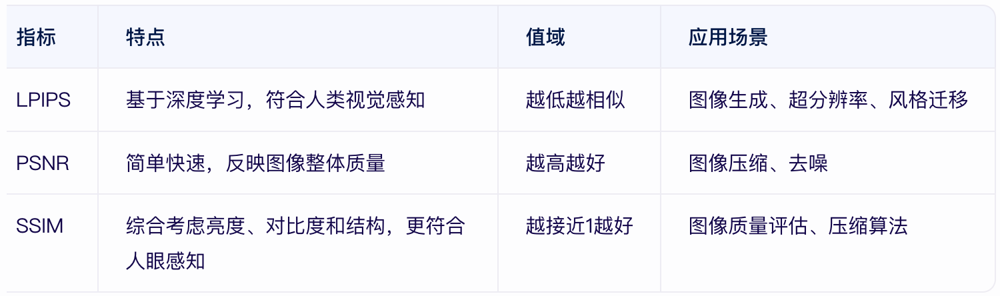

## Comparsion of Different Metrics

### 1.LPIPS（Learned Perceptual Image Patch Similarity）
定义: LPIPS是一种基于深度学习的图像质量评价指标，通过预训练的卷积神经网络（如AlexNet、VGG等）提取图像特征，计算特征空间中的距离来评估图像的感知相似性。与传统像素级指标（如PSNR）不同，LPIPS更符合人类视觉系统的感知。

值域：LPIPS值越低，表示两幅图像越相似。

应用场景：图像生成（GAN）、图像超分辨率、风格迁移等。
```python
import torch
import lpips

# 初始化LPIPS模型（使用AlexNet作为骨干网络）
loss_fn = lpips.LPIPS(net='alex')

# 加载两幅图像（假设已转换为Tensor，形状为[1, 3, H, W]）
img1 = torch.randn(1, 3, 256, 256)  # 示例图像1
img2 = torch.randn(1, 3, 256, 256)  # 示例图像2

# 计算LPIPS距离
distance = loss_fn(img1, img2)
print(f"LPIPS距离: {distance.item()}")
```

---
### 2.SSIM（Structural Similarity Index）
定义: SSIM是结构相似性指数，通过比较两幅图像的亮度、对比度和结构信息来评估它们的相似性。SSIM值越接近1，表示两幅图像越相似。

值域：SSIM值在0到1之间。

应用场景：图像压缩、图像去噪、图像超分辨率等。
```python
from skimage.metrics import structural_similarity as ssim
import numpy as np

# 示例图像（需保证尺寸相同）
img1 = np.random.rand(256, 256, 3) * 255  # 示例图像1
img2 = np.random.rand(256, 256, 3) * 255  # 示例图像2

# 计算SSIM值
ssim_value = ssim(img1, img2, multichannel=True)
print(f"SSIM值: {ssim_value:.4f}")
```
---
### 3. PSNR（Peak Signal-to-Noise Ratio）
定义: PSNR是峰值信噪比，通过计算原始图像与处理后的图像之间的均方误差（MSE）来衡量图像质量。PSNR值越高，表示图像质量越好。

计算公式:PSNR=20⋅log10(MAXi/MSE**(1/2))其中，MAXi是像素值的最大值（如8位图像为255），MSE是两幅图像之间的均方误差。
```python
import numpy as np

def calculate_psnr(img1, img2, max_pixel=255.0):
    """
    计算两幅图像的PSNR值
    :param img1: 输入图像1（NumPy数组）
    :param img2: 输入图像2（NumPy数组）
    :param max_pixel: 像素最大值（默认255）
    :return: PSNR值（dB）
    """
    mse = np.mean((img1 - img2) ** 2)
    if mse == 0:
        return 100  # 完美匹配
    return 20 * np.log10(max_pixel / np.sqrt(mse))

# 示例用法
img1 = np.random.rand(256, 256, 3) * 255  # 示例图像1
img2 = np.random.rand(256, 256, 3) * 255  # 示例图像2
psnr_value = calculate_psnr(img1, img2)
print(f"PSNR值: {psnr_value:.2f} dB")
```
---
